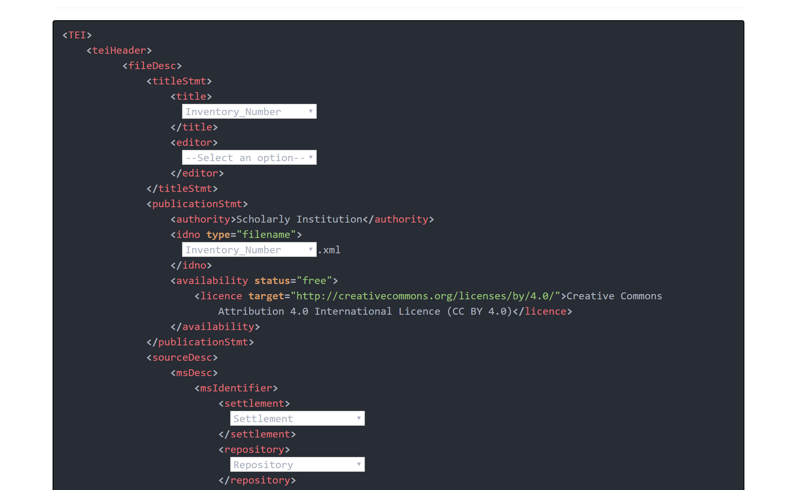
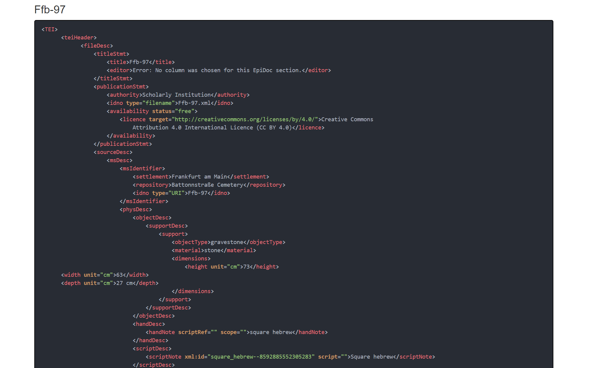

# csv-to-epidoc

<!-- TOC START min:1 max:3 link:true update:true -->
- [csv-to-epidoc](#csv-to-epidoc)
  - [Mapping](#mapping)
  - [Conversion process and customizability](#conversion-process-and-customizability)
  - [Specific conversions](#specific-conversions)
    - [Paragraphs and linebreaks](#paragraphs-and-linebreaks)
    - [Other list-like structures](#other-list-like-structures)
    - [Dimensions](#dimensions)

<!-- TOC END -->


Many scholars — in epigraphy as well as in other fields associated with scholarly editions — tend to record and organize their data, compiled on field or archive trips, as tabular data, before starting to compose a historical narrative or a printable scholarly edition.

This [tool](https://hou2zi0.github.io/csv-to-epidoc/HTML/csv-to-epidoc.html) wants to provide an easy path to map the columns of the tabular data to specific fields in a basic EpiDoc template, therefore giving the means to easily convert CSV files into basic EpdiDoc. Starting from these basic EpiDoc files the scholar may dive further into XML based approaches to digital scholarly editing or just simply fill in missing values and provide basic EpiDoc versions of her scholarship as reusable research data.  

## Mapping

Converts a character-separated value file into TEI-XML EpiDoc files. The conversion is based on a basic EpiDoc template and – currently very basic – conversion functions associated with different sections of the EpiDoc template.

The user loads up a CSV-file and selects the mapping of columns to EpiDoc section by usage of the dropdown menus generated based on the CSV file’s columns. Subsequently, the user mapping is applied to each row of the CSV. The generated EpiDoc files are bundled into an `teiCorpus` and downloaded; because not all attribute values can be set automatically, the file will be well formed, but not valid.






An example csv file with pipe separators may be found here: [here](https://hou2zi0.github.io/csv-to-epidoc/data/files/epidat.csv)

The example file was provided by [Thomas Kollatz](https://github.com/KollatzThomas)and is licensed as follows:

[Steinheim-Institut](http://steinheim-institut.de/)
[http://www.steinheim-institut.de:80/cgi-bin/epidat?id=ffb](http://www.steinheim-institut.de:80/cgi-bin/epidat?id=ffb) lizenziert unter einer Creative Commons Lizenzvertrag
[Creative Commons Namensnennung 4.0](http://creativecommons.org/licenses/by/4.0/) Internationale Lizenz

## Conversion process and customizability

The in-file conversion procedure is controlled by a `switch` statement having one arm for each EpiDoc element or section, that needs further processing Thus it is easily customizable. See below:

```javascript
[…]
switch (element) {
  case 'person':
    return text.split('\n')
      .map((textblock, index) => {
        return `<person xml:id="${generateID(textblock)}" sex="1">
                    <persName>
                    ${textblock.trim()}
                    </persName>
                    <birth/>
                    <death/>
                    <floruit/>
                </person>`
      })
      .join('\n');
    break;
  case 'lb':
    return text.split('\n')
      .map((textblock, index) => {
        return `<${element} n="${index+1}"/>${textblock.trim()}`
      })
      .join('\n');
    break;
[…]
```

## Specific conversions

### Paragraphs and linebreaks

EpiDoc section that contain linebreaks or paragraphs will try to split incoming textparts on a newline (“enter key”) and subsequently try to apply basic conversion to produce the required EpiDoc XML markup for this section.

### Other list-like structures

Other “list-like structures”, like `handNote` or `persList` will try to split incoming textparts on a newline (“enter key”) and subsequently try to apply basic conversion to produce the required EpiDoc XML markup for this section.

### Dimensions

The dimensions section expects one string `height x width x depth` and trys to split it on `x` (this feature will be customizable, see To Do).

## Software used

The tool is based on the JavaScript libraries [D3](https://d3js.org/) and [_lodash](https://lodash.com). It was inspired by reading the [Learn JS Data](http://learnjsdata.com/index.html) tutorial.

## To Do

* Make mor customization possible, e.g. for splitting of textparts.
* Provide possibility to add a CSV file containing data about the persons referenced in `persList`.
* Better support for none/NaN values or missing values.
* Adding dropdown for facsimile section.

## License

MIT License

Copyright (c) 2018 Max Grüntgens (猴子)

Permission is hereby granted, free of charge, to any person obtaining a copy
of this software and associated documentation files (the "Software"), to deal
in the Software without restriction, including without limitation the rights
to use, copy, modify, merge, publish, distribute, sublicense, and/or sell
copies of the Software, and to permit persons to whom the Software is
furnished to do so, subject to the following conditions:

The above copyright notice and this permission notice shall be included in all
copies or substantial portions of the Software.

THE SOFTWARE IS PROVIDED "AS IS", WITHOUT WARRANTY OF ANY KIND, EXPRESS OR
IMPLIED, INCLUDING BUT NOT LIMITED TO THE WARRANTIES OF MERCHANTABILITY,
FITNESS FOR A PARTICULAR PURPOSE AND NONINFRINGEMENT. IN NO EVENT SHALL THE
AUTHORS OR COPYRIGHT HOLDERS BE LIABLE FOR ANY CLAIM, DAMAGES OR OTHER
LIABILITY, WHETHER IN AN ACTION OF CONTRACT, TORT OR OTHERWISE, ARISING FROM,
OUT OF OR IN CONNECTION WITH THE SOFTWARE OR THE USE OR OTHER DEALINGS IN THE
SOFTWARE.
